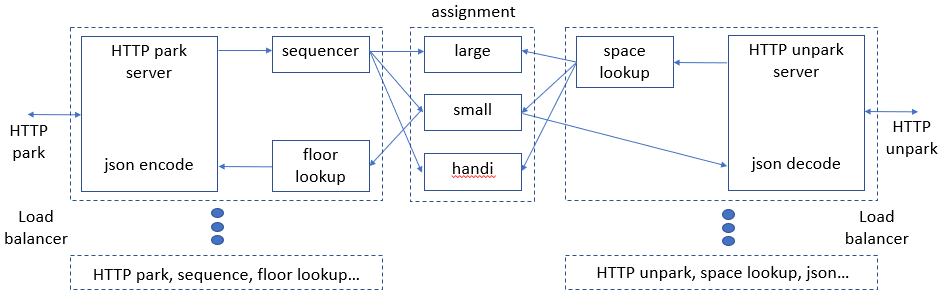

# API Scaling

A  [parking garage](../README.md) [API](../API_spec.md) was implemented as a REST API demonstration vehicle. 
ALthough this particular application wouldn't need to operate at scale,  this development effort is a proxy for 
API implementations that do need to scale. Consequently, the implementation was designed to maximize scalability.

The implementation chosen is shown here, where parking and API requests are shown coming
in from the left and the unparking API requests coming right for clarity. 
For high traffic handling, the park server and unpark server (shown in dotted lines) can be replicated, 
with a load balancer to distribute traffic.

The parking API requests are handled by a REST server, which processes requests which encoded as JSON, 
and error checks the JSON input and parses them into a computer language format. 

Under optimum conditions, a request for a parking space finds a parking space matching the vehicle type. 
However, a small car can be parked in a large space, and a handicap car can be parked in either a small or large space. 
A controller/sequencer requests a space of the desired type (large, small, or handicap space), then requests
the appropriate alternatives if the desired space type is not available.

The allocation of parking spaces is not thread-safe, and so the data structure for this step are designed
to be as simple as possible for scalability. The parking spaces are broken up into linear arrays of 
handicap spaces, small car spaces, and large car spaces which allow for fastest access of non-thread safe operations. 
For the parking API interface, the space allocated by one of these linear arrays is converted into
floor/row/space format in a table lookup. The results are encoded in JSON, and returned via HTTP by the Park server.

For best scalability, allocation of the three space types can be handled by three separate parking space allocation
services. However these three services do interact when no handicap parking is available, as the parking space allocated
should be the large or small parking space closest to the entrance. One way to handle this with this three
parking space server architecture is to have an unfilled handicap parking space need generate a request for both a 
small parking space and large parking space, check which of the two spaces is closest to the entrace,
then return the unneeded extra parking space using the 'unpark' function.

For the unpark API interface, the json input format of garage level/row/space is converted with a table lookup,
which selects the parking data from one of the three linear data arrays. As the parking location is known,
the parking space allocation can be quickly found and freed without requiring a sequencer.

## Scaling Options
Steps to scale this application include:
* Use faster servers. Here the free AWS servers are used for benchmarking, but much more powerful servers 
    are available for scaling a high-traffic application.
* Use multiple parking/unparking request servers with load balancing.
* Break up each of the three central data servers further into more servers each handling a range of parking spaces.
  This requires significantly more complex coordination for allocating spaces (similar to the map-reduce algorithm.
* Implement faster software. Some options include:
  * faster server interface (Falcon, Tornado,...)
  * faster python implementations (Numpy arrays, Pypy)
  * faster languages (C, Go, etc)
  
## Benchmarking - T2Micro Instance
AWS `t2micro` instances were used for developing benchmarks, as these instances are readily available and free for limited usage.
This benchmarking process would need to be repeated using production scale hardware to draw reliable conclusions.

A simple benchmark was tested, starting with an empty garage, then adding 120 small cars 
  (enough to fill up all the non-handicap small and large parking spaces). 
The park server computation time is broken down into segments
  * HTTP handling (*not profiled yet*)
  * Park json error checking and decoding
  * Sequencer
  * Parking space search
  * floor table lookup
  * Park json encoding (*not profiled yet*)

The unpark server can be broken down into segments (*not profiled yet*): HTTP handling, json decoding, parking space lookup table lookup, parking space access, and json encoding
  
Here is a table showing the computation time on an AWS `t2micro` instance (averaged over assigning all of the parking spaces).

validate | sequence | assignment | floor lookup | total
-------- | -------- | ---------- | ------------ | -----
0.6us    | 2us      | 1us        | 0.3us        | 4us

The processing bottleneck is the `assignment` step, which would limit API request to about ~500k/sec using a single-threaded
assignment server (which might need to check several of the parking data structures to find a space). 
By splitting the parking data across three servers each handling one type of parking space,
(e.g. using three central allocation `t2micro` instances - one for handicap car spaces, one for small car spaces, one for large car spaces),
this limited rate might be 2x higher (~1M req/sec). This esimated speed will be reduced somewhat by the 
time to handle unparking requests, which should take less time than parking request (but this hasn't been profiled yet).

### Numpy + Numba
Python uses lists rather than true arrays for data storage, which is rarely optimal for maximum speed.
[Numpy](https://numpy.org/) offers arrays of fixed datatypes, which seem much better suited rapid processing of uniform data
than the more general Python lists which can hold any kind of data. Numpy arrays allow for very rapid processing
of vector arithmatic, as adding and processing Numpy vectors is done rapidly in C.

Although operating on Numpy arrays is generally much more efficient than on Python lists, initially the Numpy benchmark
ran *SLOWER* than with Python arrays. This is due to a [well known issue](https://github.com/numpy/numpy/issues/2269) with 
the way Numpy finds [values in an array](https://stackoverflow.com/questions/7632963/numpy-find-first-index-of-value-fast). 
Rather than stopping after finding one target value, Numpy continues to find all of the matching values and then allocates
an array to put them in, before the user then deletes most of the list of matching elements to extract the first value in the list.

[Numba](http://numba.pydata.org/) is an open-source just in time (JIT) compiler which can speed up many Python subroutines,
and works well with Numpy. The loop to extract the space assignment data runs almost 2x faster after applying the Numba JIT compiler.

validate | sequence | assignment | floor lookup | total
-------- | -------- | ---------- | ------------ | -----
0.6us    | 2us      | 0.6us      | 0.3us        | 3.5us

### Pypy
[Pypy](https://pypy.org/) is a python environment that offers just-in-time (JIT) compilation for the entire Python program,
and often significantly improves the speed of python code, while offering [good compatibility](https://pypy.org/compat.html) 
with existing python code.

validate | sequence | assignment | floor lookup | total
-------- | -------- | ---------- | ------------ | -----
0.05us   | 0.74us   | 0.06us     | 0.04us       | 0.89us (Python)

## Server / API Framework
An API framework is often used with Python programs. Web servers such as [Flask](https://www.fullstackpython.com/flask.html) 
can be used for simple Python API demonstrations, but Flask is [not recommended](https://vsupalov.com/flask-web-server-in-production/) 
for directly serving HTTP requests. The web server such as Ngnix can be configured for the API front end. 

[Faster Python API frameworks](https://nordicapis.com/8-open-source-frameworks-for-building-apis-in-python/) are available
for serving large numbers of concurrent clients, such as [Falcon](https://falconframework.org/#sectionAbout), 
[Tornado](https://www.tornadoweb.org/en/stable/), and [Twisted](https://twistedmatrix.com/trac/) API frameworks.

### Profiling API
Locust is one of the more popular command line applications for profiling APIs, and is written in Python, 
which is convenient for developers testing APIs written in Python.

